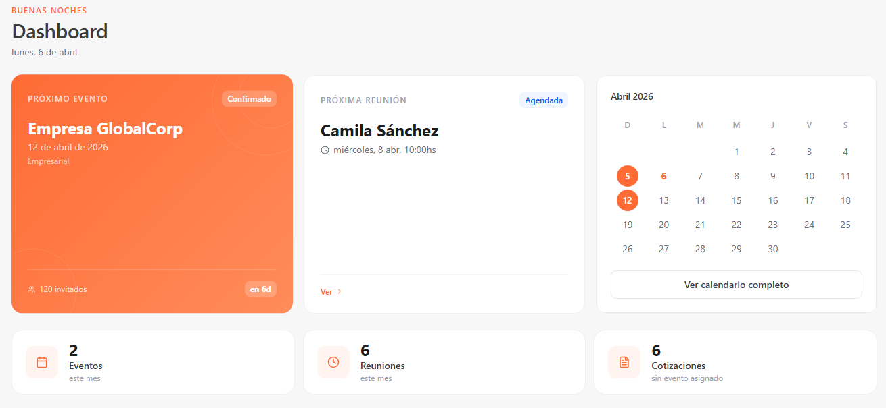
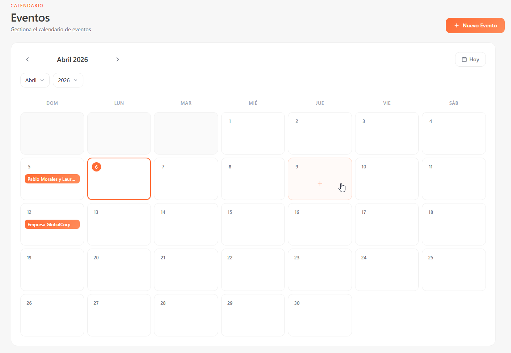
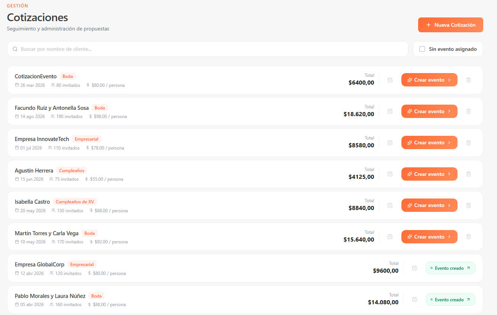
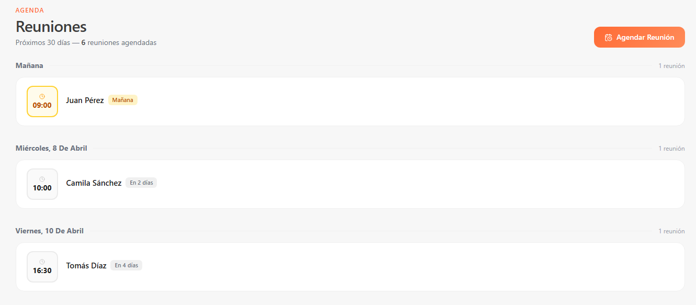
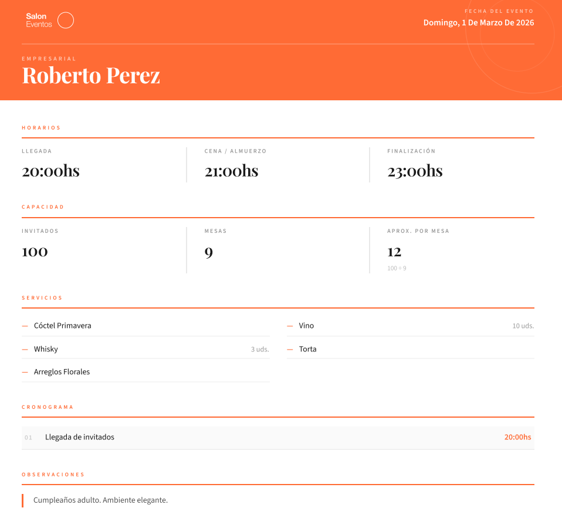

<div align="center">


<br />

**Aplicación web fullstack para la gestión integral de eventos, cotizaciones y reuniones.**

<br />


</div>

---

## 📋 Descripción

**Gestor de Salón de Eventos** es una aplicación web diseñada para simplificar la administración de un salón de fiestas. Permite llevar un registro completo de eventos, cotizaciones y reuniones con clientes, incluyendo la planificación detallada de cada evento y la generación de documentos PDF profesionales.

---

## ✨ Funcionalidades

### 📅 Eventos
- Calendario mensual interactivo con navegación libre
- Alta, edición y eliminación de eventos
- Navegación directa desde una cotización a su evento vinculado
- Detalle del evento en un panel lateral deslizable

### 📋 Planificación de Eventos
- Wizard en 3 pasos: horarios, servicios y cronograma
- Checklist de servicios con campos extra por servicio (cantidades, descripciones)
- Cronograma sortable con drag & drop
- Timings predefinidos seleccionables desde base de datos
- Descarga de planificación en PDF con diseño profesional

### 💰 Cotizaciones
- Listado con búsqueda en tiempo real y filtros
- Creación de evento directamente desde una cotización
- Agendamiento de reuniones vinculadas a cotizaciones
- Indicador visual de estado (sin evento / evento creado)

### 🤝 Reuniones
- Agenda de reuniones de los próximos 30 días
- Agrupadas por día con badges de proximidad (Hoy / Mañana / En X días)
- Alta con selector de hora y timings predefinidos
- Vinculación con cotizaciones existentes

### 📊 Dashboard
- Vista general con próximo evento y próxima reunión
- Mini calendario con eventos del mes
- Estadísticas en tiempo real: eventos, reuniones y cotizaciones pendientes

---

## 🖼️ Capturas

### Dashboard


### Eventos
**Calendario mensual**


### Cotizaciones
**Listado de cotizaciones**


### Reuniones
**Agenda de reuniones**


### PDF de Planificación


---

## 🏗️ Arquitectura

El proyecto sigue una arquitectura en capas con separación clara de responsabilidades:

```
├── Frontend (Next.js)
│   ├── app/               # Páginas y rutas (App Router)
│   ├── components/        # Componentes reutilizables
│   ├── services/          # Comunicación con la API
│   └── types/             # Interfaces TypeScript
│
└── Backend (.NET)
    ├── API                # Controllers y endpoints REST
    ├── LogicaDeAplicacion # Casos de uso (CU) e interfaces
    ├── LogicaDeNegocio    # Entidades y reglas de negocio
    └── AccesoDatos        # Repositorios con Entity Framework
```

### Patrones de diseño aplicados
- **Repositorio** — abstracción del acceso a datos, desacoplando la lógica de negocio de la persistencia
- **Inyección de dependencias** — los casos de uso y repositorios se inyectan mediante interfaces, facilitando el testing y la extensibilidad
- **DTO + Mapper** — transferencia de datos entre capas sin exponer entidades directamente

---

## 🛠️ Stack Tecnológico

### Frontend
| Tecnología | Uso |
|---|---|
| **Next.js 15** | Framework React con App Router |
| **React 19** | Librería de UI |
| **TypeScript** | Tipado estático |
| **Tailwind CSS** | Estilos utilitarios |
| **Framer Motion** | Animaciones |
| **Lucide React** | Iconografía |
| **Puppeteer** | Generación de PDFs |

### Backend
| Tecnología | Uso |
|---|---|
| **C# .NET 8** | API RESTful |
| **Entity Framework Core 8** | ORM |
| **SQL Server** | Base de datos relacional |

---

## 🚀 Instalación y uso local

### Prerequisitos
- Node.js 18+
- .NET 8 SDK
- SQL Server

### Frontend

```bash
git clone https://github.com/Juani1603/gestor-de-salon-de-eventos.git
cd gestor-de-salon-de-eventos/frontend
npm install
```

Creá un archivo `.env.local` en la carpeta `frontend`:

```env
NEXT_PUBLIC_API_URL=http://localhost:5013/api
```

```bash
npm run dev
```

### Backend

```bash
cd backend
dotnet restore
```

Configurá la cadena de conexión en `appsettings.json`:

```json
{
  "ConnectionStrings": {
    "DefaultConnection": "Server=localhost;Database=SalonEventos;Trusted_Connection=True;"
  }
}
```

```bash
dotnet ef database update
dotnet run
```

---

## 📐 Modelo de datos

> *Diagrama UML próximamente*

---

## 📄 Licencia

Este proyecto es de uso libre con fines educativos y de exhibición.

---

<div align="center">
  <p>Desarrollado con ❤️ por <a href="https://github.com/Juani1603">Juani1603</a></p>
</div>
